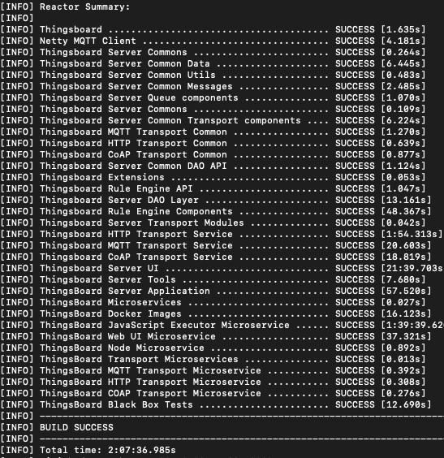
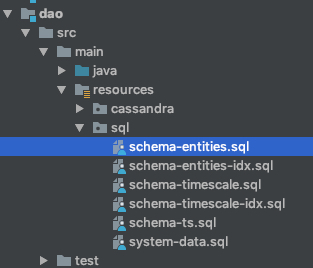

# 安装环境
参考https://blog.csdn.net/ieflex/article/details/97106750

- jdk1.8+
- maven3
- nodejs8+

# 安装步骤
1. mvn clean install –DskipTests

第一次安装时间比较长，我装了2个小时，安装完成如下



2. 安装postgres
- 安装timescaledb时序数据库插件，参考https://github.com/digoal/blog/blob/master/201801/20180129_01.md
- 通过navicat运行sql文件,运行dao/src/main/resources/sql/*.sql



3. 安装redis

4. 修改配置

修改application/src/main/resources/thingsboard.yml文件中的postgres,redis

```yml
# SQL DAO Configuration
spring:
  data:
    jpa:
      repositories:
        enabled: "true"
  jpa:
    open-in-view: "false"
    hibernate:
      ddl-auto: "none"
    database-platform: "${SPRING_JPA_DATABASE_PLATFORM:org.hibernate.dialect.PostgreSQLDialect}"
  datasource:
    driverClassName: "${SPRING_DRIVER_CLASS_NAME:org.postgresql.Driver}"
    url: "${SPRING_DATASOURCE_URL:jdbc:postgresql://192.168.3.22:5432/thingsboard}"
    username: "${SPRING_DATASOURCE_USERNAME:postgres}"
    password: "${SPRING_DATASOURCE_PASSWORD:123456}"
    hikari:
      maximumPoolSize: "${SPRING_DATASOURCE_MAXIMUM_POOL_SIZE:50}"
```

```yml
redis:
  # standalone or cluster
  connection:
    type: standalone
  standalone:
    host: "${REDIS_HOST:192.168.3.22}"
    port: "${REDIS_PORT:6379}"
```

5. 运行applicaton
java -jar application/thingsboard.jar
