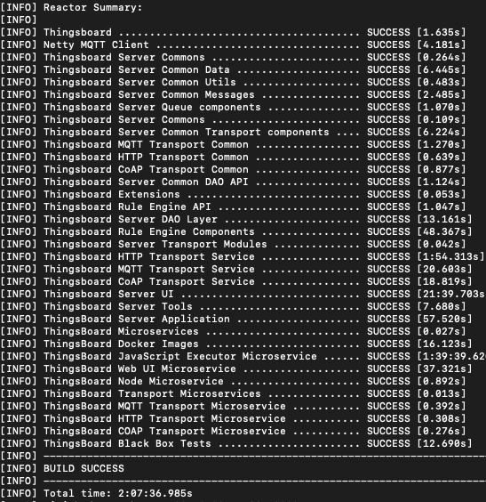
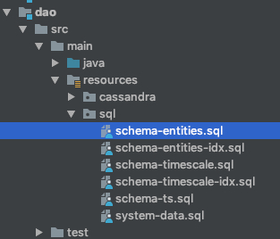

# 安装环境
1. 参考[ThingBoard](https://blog.csdn.net/ieflex/article/details/97106750)
2. 参考CSDN[CSDN博客](https://blog.csdn.net/ieflex/article/details/97106750)
- jdk1.8+
- maven3
- nodejs8+
- git

# 安装步骤
### Maven Install
mvn clean install -DskipTests

第一次安装时间比较长，安装完成如下,
如果安装时候报License错误，可以去掉pom下面的license-maven-plugin



###  安装postgres
- 安装timescaledb时序数据库插件，参考https://github.com/digoal/blog/blob/master/201801/20180129_01.md
- 通过navicat运行sql文件,运行dao/src/main/resources/sql/*.sql



### 安装redis

### 修改配置

修改application/src/main/resources/thingsboard.yml文件中的postgres,redis

```yml
# SQL DAO Configuration
spring:
  datasource:
    driverClassName: "${SPRING_DRIVER_CLASS_NAME:org.postgresql.Driver}"
    url: "${SPRING_DATASOURCE_URL:jdbc:postgresql://192.168.3.22:5432/thingsboard}"
    username: "${SPRING_DATASOURCE_USERNAME:postgres}"
    password: "${SPRING_DATASOURCE_PASSWORD:123456}"
```
```yml
redis:
  # standalone or cluster
  standalone:
    host: "${REDIS_HOST:192.168.3.22}"
    port: "${REDIS_PORT:6379}"
```

### 运行applicaton
java -jar application/thingsboard-boot.jar

## TB概念介绍
- **Tenant租户**，TB是多租户的，一个租户代表客户、资产、设备、仪表的集合，通过表增加tenant_id字段来实现多租户管理
- **Customer客户**，代表一家IOT物联网公司或IOT公司的服务商，租户和客户是一对多关系
- **User用户**，登陆用户，客户和用户是一对多关系
- **Asset资产**，公司的有形或无形资产，一般代表楼宇、大厦等，可以理解为存放设备的地理位置
- **Device设备**，网关或者设备，跟客户关联
- **EntityView**，实体视图，官方说法类似于SQL View，用于控制向客户展示的数据内容和权限，所有设备数据展示都是通过EV层来实现的
- **Widget部件库**，强大的控件库，有chart报表控件，control widget控制控件，alarm告警控件，maps地图控件等十多个控件，读取EV数据，可以json自定义控件
- **Dashboard仪表库**，用于向用户展示的UI页面，控件库的组合，含有页面布局，控件选择和样式，发布页面等功能
- **Audit审计日志**，所有管理员和用户的操作都会记录到Audit库


## 操作流程
### 使用默认系统管理员登陆系统创建租户管理员，使用默认系统账户登陆：

Systen Administrator: sysadmin@thingsboard.org / sysadmin

租户->创建租户->创建租户管理员T1->使用租户管理员登陆TB系统


### 使用租户管理员创建客户

新增一个“C1客户”，属性、最新遥测、警告、事件、关联、审计日志这几个是客户、资产、设备共用的模板，客户一般不用填写

C1客户下创建U1用户，客户C1可以使用U1用户进行登录，配置资产和设备，为了方便，统一在T1下进行配置C1客户设备，配置完后用U1登录看到的是一样的

### 创建资产

创建资产“资产大夏”，跟客户C1绑定

一般应用需要在地图上显示资产位置（使用DashBoard的仪表插件Maps），可以添加自定义精度和维度属性，指定为服务器属性

### 创建设备

创建D1设备，跟客户C1绑定，
- 属性
 - 服务端属性，不填， 默认包括设备状态active，设备不活跃时刻inactiveAlarmTime，设备最后活跃时刻lastActiveTime，设备最后连接时刻lastConnectTime，设备最后失联时刻lastDisconnectTime
 - 客户端属性，设备本地上传来的属性，设备json{key:value}上传的数据会自动识别出来作为客户端属性
 - 共享属性，不填
- 最新遥测，自动显示设备最新上传的时序数据，例如huminity,temperature

### 实体视图

创建E1，跟客户C1绑定
- 目标实体，选择设备，选择D1
- 属性传播，不填
- 开始时间，结束时间，限制部件、仪表使用的时候查询设备数据的时间，比如设置了一周内的，如果你要查询一年的数据是不允许的。


### 创建仪表盘
- 仪表板库->创建仪表板
- 添加仪表板部件->添加实体
- 添加别名，类型选择设备类型->然后就会出现你刚刚创建的设备
- 创建新部件->选择Charts类型

### 绑定仪表盘和监控设备传递来的数据
- 双击要使用的图表->点击添加数据源->选择之前创建的实体->选择具体数据字段（数据来源于下一步MQTT发送来的数据，可以先跳过）->添加

### 导入部件库

部件库->导入，选择application/src/main/resources/data/json/system/widget_bundles,需要用管理员账号导入 

### 发送设备数据

- http方式，http curl -v -X POST -d @telemetry-data-as-object.json http://localhost:8080/api/v1/$ACCESS_TOKEN/telemetry --header "Content-Type:application/json"
- mqtt方式，node mqtt/simulaor.js ${Token}

### 服务端控制设备
- node mqtt/simulator-contral.js ${Token}
- 添加Control Widget，选择温度

### Mqtt客户端测试
- 安装node.js,设置node的环境变量
- 安装mqtt客户端
  - cd ${NODE_PATH}, npm install mqtt,这样就可以使用mqtt批处理命令
1. 推送时序消息, 注意$ACCESS_TOKEN不需要单引号，在设备->最新遥测会显示
```shell script
mqtt pub -v -h "127.0.0.1" -t "v1/devices/me/telemetry" -u '$ACCESS_TOKEN' -m {'key':'value'}
```
2. 发送设备客户端属性，在设备的属性->客户端属性会显示出来
```shell script
mqtt pub -d -h "127.0.0.1" -t "v1/devices/me/attributes" -u '$ACCESS_TOKEN' -m {'key':'value'}
```
3. 获取设备属性
```jshelllanguage
var mqtt = require('mqtt')
var client  = mqtt.connect('mqtt://127.0.0.1',{
    username: process.env.TOKEN
})

client.on('connect', function () {
    console.log('connected')
    client.subscribe('v1/devices/me/attributes/response/+')
    client.publish('v1/devices/me/attributes/request/1', '{"clientKeys":"attribute1,attribute2", "sharedKeys":"shared1,shared2"}')
})

client.on('message', function (topic, message) {
    console.log('response.topic: ' + topic)
    console.log('response.body: ' + message.toString())
    client.end()
})
```
```shell script
export TOKEN=$ACCESS_TOKEN
node mqtt-js-attributes-request.js
```
4. 订阅设备属性更新
```shell script
# Subscribes to attribute updates
mqtt sub -v "127.0.0.1" -t "v1/devices/me/attributes" -u '$ACCESS_TOKEN'
```
5. 订阅服务端RPC
```jshelllanguage
var mqtt = require('mqtt');
var client  = mqtt.connect('mqtt://127.0.0.1',{
    username: process.env.TOKEN
});

client.on('connect', function () {
    console.log('connected');
    client.subscribe('v1/devices/me/rpc/request/+')
});

client.on('message', function (topic, message) {
    console.log('request.topic: ' + topic);
    console.log('request.body: ' + message.toString());
    var requestId = topic.slice('v1/devices/me/rpc/request/'.length);
    //client acts as an echo service
    client.publish('v1/devices/me/rpc/response/' + requestId, message);
});
```
6. 订阅客户端RPC
```jshelllanguage
var mqtt = require('mqtt');
var client = mqtt.connect('mqtt://127.0.0.1', {
    username: process.env.TOKEN
});

client.on('connect', function () {
    console.log('connected');
    client.subscribe('v1/devices/me/rpc/response/+');
    var requestId = 1;
    var request = {
        "method": "getTime",
        "params": {}
    };
    client.publish('v1/devices/me/rpc/request/' + requestId, JSON.stringify(request));
});

client.on('message', function (topic, message) {
    console.log('response.topic: ' + topic);
    console.log('response.body: ' + message.toString());
});
```